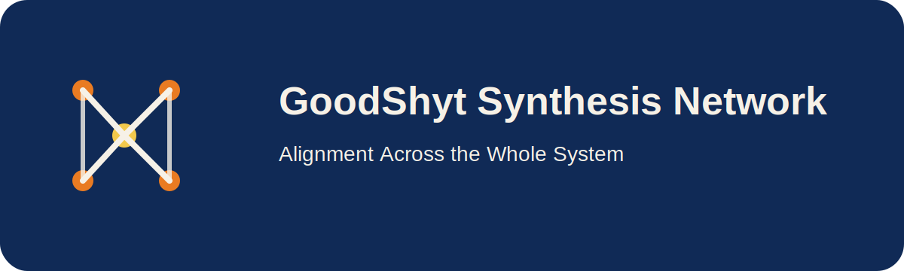

# GoodShyt Synthesis Network



Federated alignment, observability, and ecosystem intelligence across the GoodShyt system network.

## Brand line
**Alignment Across the Whole System**

## Features
- subsystem registration
- network state aggregation
- GMI-style composite scoring
- drift summaries and health snapshots
- FastAPI service for runtime synthesis

## Quickstart
```bash
pip install -e .[dev]
uvicorn goodshyt_synthesis_network.api:app --reload
```

## Visual assets
- `assets/logos/primary.svg`
- `assets/logos/mark-dark.svg`
- `assets/covers/repo-cover.svg`

**Architected by Deonte Watts**  
**GoodShyt Group**
